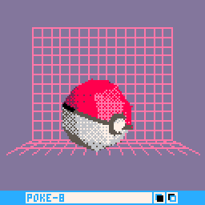
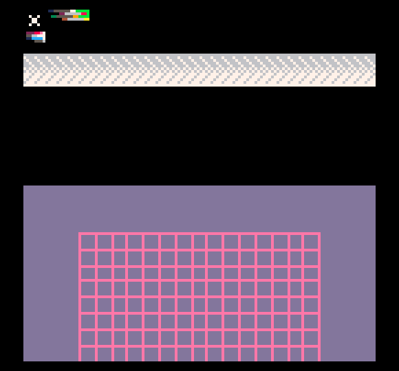

# Everyday One Motion - 20160728  

"POKE-8"  

  

PICO-8  

[Everyday One Motion](http://motions.work/motion/338)  
[Cartridge](http://www.lexaloffle.com/bbs/?tid=3942)  

## POKE-8

PICO-8 ポリゴン表現 真骨頂  
[ここまでのあらすじ](https://github.com/fms-cat-eom/20160721)  

## Boing Ball

元ネタはBoing Ballという、AmigaというホビーPCの性能をデモンストレーションするためのDemoです。  
このボールはDemosceneを象徴するシンボルとして親しまれています。  
https://www.youtube.com/watch?v=ssUleIBKOW8  

## Pokémon GO  

ポケモンGOブームに乗っかって、今週のEOMはポケモンに沿ったものが多かったため、ぼくも雑ではありますが乗っかってみました。  
ということで、Boing BallのボールをPoke Ballにしました。  

## Dithered Polygon

ついに私はやり遂げました。ディザリングでシェーディングされたポリゴンをPICO-8上で表示することに成功しました。  
前回同様、三角系の描画はy軸ごとに描画していくことで実現しているのですが、今回は線の代わりにスプライトを描画しています。  

↑ メモリからダンプしたスプライトシート。

上のスプライトシートを見ていただくと、横長の灰色・白色のスプライトがあるのですが、これを一行ごとにある「規則」で三角形状に並べていくことによって、ディザリングされた三角形を実現しています。  
ちなみに、その「規則」もスプライトシートに収録されています。一番上のxの右にある、カラフルな線がそうです。意味わからないですよね。ぼくももう分かりません。  

## Subdivided Octahedron

ただ、このアルゴリズムはさすがに少し重いため、これ以上ポリゴンを増やすと処理が追いつかず、普通の球体をポリゴンとする手法では、いびつな形のものしか実現できませんでした。  
そこで今回は、整った形の球体を少ないポリゴン数で実現するため、八面体を分割していき球体の形とする手法を実装しました。  

詳しくは [eom_20160825](https://github.com/fms-cat-eom/20160825) をご覧ください。  
